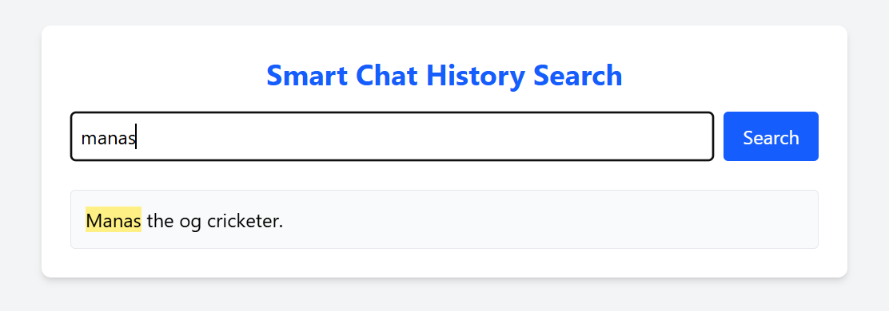
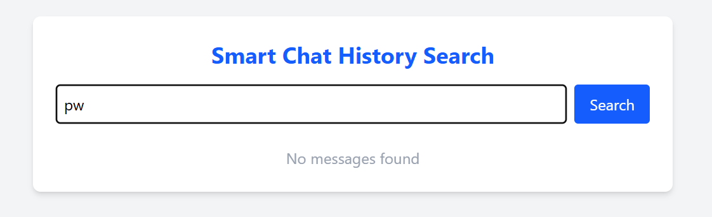

# Smart Chat History Search

Smart Chat History Search is a full-stack project that allows users to **search through chat history** using a fast, C++ backend and a modern React frontend. The project demonstrates efficient text search, a clean UI, and containerized deployment.

---

## Features

- 🔍 **Instant Search:** Type a word or phrase to instantly search your chat history.
- ⚡ **Fast Backend:** C++ backend with an inverted index for efficient searching.
- 🖥️ **Modern Frontend:** React + Tailwind CSS for a responsive, user-friendly interface.
- 🐳 **Dockerized:** Easy to build and run anywhere with Docker.
- 🌐 **REST API:** Simple `/search?q=your_query` endpoint.
- 📄 **Configurable Data:** Easily update your `messages.txt` file to change the searchable history.

---

## How It Works

### 1. Backend (C++)

- Loads all chat messages from `messages.txt` at startup.
- Builds an **inverted index** for fast word lookups.
- Exposes a REST API endpoint `/search?q=your_query` that returns all messages containing the query (case-insensitive, punctuation-insensitive).
- Returns results as JSON.

### 2. Frontend (React)

- Clean, single-page app for searching chat history.
- Highlights search terms in results.
- Shows loading state and "No messages found" if nothing matches.
- Responsive and mobile-friendly.

---

## Project Structure

```
SmartSearchHistory/
├── Backend/
│   ├── main.cpp
│   ├── httplib.h
│   ├── messages.txt
│   └── Dockerfile
├── Frontend/
│   ├── src/
│   │   └── App.jsx
│   └── ... (React app files)
├── README.md
```

---

## Getting Started
---

### 1. Run with Docker

#### Backend

```sh
cd Backend
docker build -t smartsearch-backend .
docker run -p 8080:8080 smartsearch-backend
```

#### Frontend

```sh
cd Frontend
npm install
# Set backend URL in .env file:
echo VITE_BACKEND_URL=http://localhost:8080 > .env
npm run dev
```

---

### 2. Manual Run (Without Docker)

#### Backend

```sh
cd Backend
g++ -std=c++17 -o server main.cpp
./server
```

#### Frontend

```sh
cd Frontend
npm install
# Set backend URL in .env file:
echo VITE_BACKEND_URL=http://localhost:8080 > .env
npm run dev
```

---

## Usage

1. Open the frontend in  browser (usually [http://localhost:5173](http://localhost:5173)).
2. Type a word or phrase in the search box and press **Search**.
3. Results will appear below, with your search term highlighted.
4. If no messages match, you'll see "No messages found".

---

## Customizing Your Chat History

- Edit `Backend/messages.txt` to add, remove, or change chat messages.
- Restart the backend server to reload the data.

---

## API Reference

### `GET /search?q=your_query`

- **Description:** Returns all messages containing the query.
- **Query Parameters:**
  - `q` (string): The search term.
- **Response:**
  ```json
  {
    "results": [
      "Message 1 containing your_query",
      "Another message with your_query"
    ]
  }
  ```

---

## Technologies Used

- **Backend:** C++17, [cpp-httplib](https://github.com/yhirose/cpp-httplib), nlohmann/json
- **Frontend:** React, Tailwind CSS, Vite
- **Containerization:** Docker

---

## Screenshots




---
---

## Author

- [Sofikul sk](https://github.com/sofikulsk02)

---

## Acknowledgements

- [cpp-httplib](https://github.com/yhirose/cpp-httplib)
- [nlohmann/json](https://github.com/nlohmann/json)
- [React](https://react.dev/)
- [Tailwind CSS](https://tailwindcss.com/)

---

## Contributing

Pull requests are welcome! For major changes, please open an issue first to discuss what you would like to change.

---

Enjoy searching your chat history with blazing speed! 🚀
